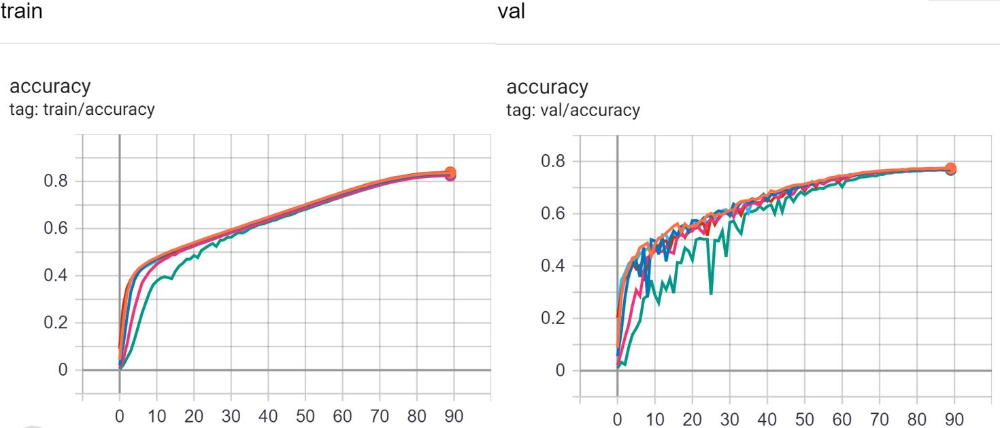

# Implementation of LARS for ImageNet with PyTorch

This is the code for the paper "[Large Batch Training of Convolutional Networks](https://arxiv.org/abs/1708.03888)", which implements a large batch deep learning optimizer called LARS using PyTorch. Although the optimizer has been released for some time and has an official TensorFlow version implementation, as far as we know, there is no reliable PyTorch version implementation, so we try to complete this work. We use [Horovod](https://github.com/horovod/horovod) to implement distributed data parallel training and provide accumulated gradient and NVIDIA DALI dataloader as options.

## Requirements

This code is validated to run with Python 3.6.10, PyTorch 1.5.0, Horovod 0.21.1, CUDA 10.0/1, CUDNN 7.6.4, and NCCL 2.4.7.

## Performance on ImageNet

We verified the implementation on the complete ImageNet-1K (ILSVRC2012) data set. The parameters and performance as follows.

| Effective Batchsize | Batchsize |     Base LR     |  Warmup Epochs   | Epsilon | Val Accuracy | TensorBoard Color |
| :-----------------: | :-------: | :-------------: | :--------------: | :-----: | :----------: | :---------------: |
|         512         |    64     |  2<sup>2</sup>  | 10/2<sup>6</sup> |  1e-5   |  **77.02%**  |    Light blue     |
|        1024         |    128    | 2<sup>2.5</sup> | 10/2<sup>5</sup> |  1e-5   |  **76.96%**  |       Brown       |
|        4096         |    128    | 2<sup>3.5</sup> | 10/2<sup>3</sup> |  1e-5   |  **77.38%**  |      Orange       |
|        8192         |    128    |  2<sup>4</sup>  | 10/2<sup>2</sup> |  1e-5   |  **77.14%**  |     Deep Blue     |
|        16384        |    128    | 2<sup>4.5</sup> |        5         |  1e-5   |  **76.96%**  |       Pink        |
|        32768        |    64     |  2<sup>5</sup>  |        14        |   0.0   |  **76.75%**  |       Green       |

Training process with TensorBoard



We set epochs = 90, weight decay = 0.0001, model = resnet50 and use NVIDIA Tesla V100/P100 GPU for all experiments. 

Thanks for computing resources from National Supercomputing Centre Singapore (NSCC), Texas Advanced Computing Center (TACC) and Swiss National Supercomputing Centre (CSCS).

## Usage

```
from lars import *
...
optimizer = create_optimizer_lars(model=model, lr=args.base_lr,
                                momentum=args.momentum, weight_decay=args.wd,
                                bn_bias_separately=args.bn_bias_separately)
...
lr_scheduler = PolynomialWarmup(optimizer, decay_steps=args.epochs * num_steps_per_epoch,
                                warmup_steps=args.warmup_epochs * num_steps_per_epoch,
                                end_lr=0.0, power=lr_power, last_epoch=-1)
...
```

Note that we recommend using create_optimizer_lars and setting bn_bias_separately=True, instead of using class Lars directly, which helps LARS skip parameters in BatchNormalization and bias, and has better performance in general. Polynomial Warmup learning rate decay is also helpful for better performance in general.

## Example Scripts

Example scripts for training with 8 GPUs and 1024 effective batch size on ImageNet-1k are provided.

```
$ mpirun -np 8 \
python pytorch_imagenet_resnet.py  \
--batch-size 128 \
--warmup-epochs 0.3125 \
--train-dir=your path/ImageNet/train/ \
--val-dir=your path/ImageNet/val \
--base-lr 5.6568542494924 \
--base-op lars \
--bn-bias-separately \
--wd 0.0001 \
--lr-scaling keep
```

## Additional Options

**Accumulated gradient**  When the GPUs is insufficient, the accumulated gradient technology can be used, which can simulate larger effective batch size using limited GPUs, although it maybe extend the running time to some extent. To use it, you just need add --batches-per-allreduce N in above command, where N is the scale factor. For example, set N = 4 here can simulate effective batch size 4096 using only  8 GPUs. 

**DALI dataloader** NVIDIA DALI can accelerate data loading and pre-processing using GPU rather than CPU, although with GPU memory tradeoff. It can also avoid some potential conflicts between MPI libraries and Horovod on some GPU clusters. To use it, please use 'pytorch_imagenet_resnet_dali.py' with '--data-dir' rather than 'train/val-dir'. For '--data-dir', it requires ImageNet-1k data in **TFRecord format** in the following structure:

```
train-recs 'path/train/*' 
val-recs 'path/validation/*' 
train-idx 'path/idx_files/train/*' 
val-idx 'path/idx_files/validation/*' 
```

## 

## Reference

[Large Batch Training of Convolutional Networks](https://arxiv.org/abs/1708.03888)

[Large-Batch Training for LSTM and Beyond](https://arxiv.org/abs/1901.08256)

https://www.comp.nus.edu.sg/~youy/lars_optimizer.py

https://github.com/tensorflow/tpu/blob/5f71c12a020403f863434e96982a840578fdd127/models/official/efficientnet/lars_optimizer.py
